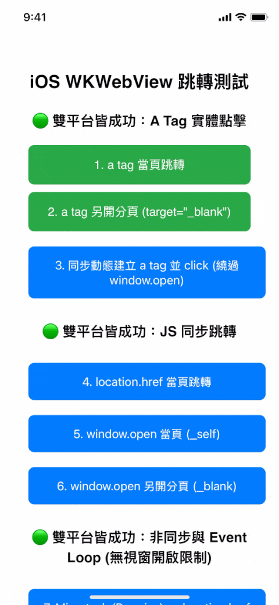
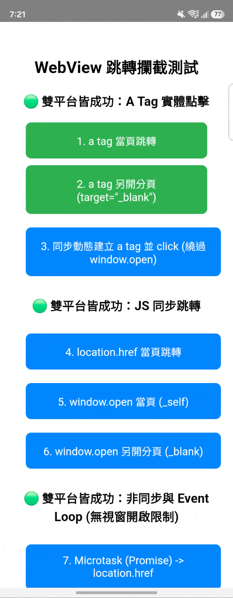

# WebView Interceptor Demo

[中文版](README.md)

This is a dual-platform (Android / iOS) WebView redirection interception testing and demonstration project.
The purpose of this project is to deeply test and verify the limits and blind spots of native interceptors in WebViews under various scenarios (such as manual clicks, script redirections, asynchronous tasks, SPA routing).

The establishment of this project stems from the common cognitive gaps during cross-domain collaboration. Many WebView behaviors that are basic common sense in the frontend field are often difficult to convince engineers from non-frontend fields simply through verbal explanation. To prevent technical discussions from devolving into subjective impressions like "that's just your imagination," this project provides a concrete experimental benchmark. It uses the most authentic dual-platform running results as the sole basis for technical verification.

## Project Structure
* **`Android/`**: Android version, using Kotlin with modern `WebViewClient` (handles in-page redirection) and `WebChromeClient` (handles new windows).
* **`IOS/`**: iOS version, using Swift with `WKWebView`, `WKNavigationDelegate` (handles in-page redirection), and `WKUIDelegate` (handles new windows).

## Test Scenarios Covered

1. **Basic Redirection Interception**: `<a href="...">`, `location.href`, `window.open`.
2. **Asynchronous Script Triggered (Event Loop Testing)**: Redirections triggered via `Promise.resolve().then` (Microtask) and `setTimeout` (Macrotask).
3. **Interception Blind Spots / Failure Testing**:
    * **SPA Routing Switch (`history.pushState`)**: Interception fails on both platforms (no reload behavior).
    * **Form Redirection (`<form>`)**:
      * **Top-level Navigation (`target="_self"`)**: Behaves like a standard `location.href` navigation and is not affected by popup blockers. However, note that **POST requests** suffer from native flaws on both platforms (Android inherently fails to intercept POST requests and penetrates directly, while iOS intercepts them but the HTTP Body is always `nil` due to IPC limitations).
      * **Opening a New Window (`target="_blank"`)**: Its behavior equates to `window.open`, making it **fully subjected to the browser's Popup Blocker**, unable to bypass asynchronous or timeout blocks.
    * **Asynchronous and Delayed Popups (`fetch` / `setTimeout` + `window.open`)**: iOS WebKit is extremely strict on async (especially `fetch` which has a 0-second grace period and is blocked immediately); Android Chromium benefits from the UAv2 mechanism and typically allows it within a 5-second grace period.
4. **Server-side Delayed 302 Redirect**:
    * Tests opening a new window (`_blank`) directly using an `a tag` or `window.open`, pointing to an API that intentionally delays for 2 seconds on the server side (simulating an async database query) before returning an HTTP 302 redirect.
    * **Result**: Works perfectly on both platforms! This proves that as long as the asynchronous waiting process is shifted to the server side, it can perfectly bypass the strict popup security restrictions imposed by WebViews on JS async callbacks.
5. **Server-side Form Bridge (GET & POST)**:
    * Tests opening an intermediary server page in a new tab (`target="_blank"`), where the intermediary page directly triggers an API call in `<script>` upon load to fetch the destination URL and parameters, and then submits a Web Form (GET / POST) to navigate to the result page.
    * **Result**: Because the new tab is opened synchronously on user click, subsequent form navigation happens within the new page's own lifecycle and successfully forwards GET and POST parameters.

---

## How to Run and Test

### 🍏 iOS Testing Method

**[Testing on Simulator] (Recommended, Easiest)**
1. Open `IOS/WebViewInterceptorDemo.xcodeproj` using Xcode.
2. In the device menu at the top center of Xcode, select any **iOS Simulator** (e.g., iPhone 15 Pro).
3. Click the **▶️ (Run)** button at the top left to start testing.
> *Simulators do not require developer certificates (Code Signing), ready to test immediately!*

**[Testing on Physical iPhone]**
1. Connect the iPhone to the computer.
2. Click the blue project icon `WebViewInterceptorDemo` in the left navigation bar of Xcode.
3. Switch to the **Signing & Capabilities** tab in the center view.
4. Check **Automatically manage signing**.
5. In the **Team** menu, select **Add an Account...** and log in with your regular Apple ID.
6. Select the Personal Team you just added. If the `Bundle Identifier` reports an error, add some random numbers at the end to make it unique.
7. Click **▶️ (Run)** to install the App on the phone.
8. **Trust Developer**: Before opening the App for the first time, go to the phone's `Settings -> General -> VPN & Device Management`, click on your Apple ID and select "Trust" to open the App successfully!

---

### 🤖 Android Testing Method

**[Testing on Simulator / Physical Device]**
1. **Using Android Studio**:
   * Open Android Studio, select `Open` and import the `Android/` folder.
   * Wait for Gradle synchronization to complete, connect the phone to the computer, and turn on "USB Debugging mode" (or start the Android simulator).
   * Click the **▶️ (Run)** button at the top to install and execute.

2. **Quick Installation using Terminal (CLI)**:
   * Make sure you have connected the physical phone or opened the simulator (`adb devices` to see devices).
   * Enter the Android folder in the terminal and execute the compilation and installation:
     ```bash
     cd Android
     ./gradlew installDebug
     ```
   * After completion, find and open the `WebViewInterceptorDemo` App on the phone or simulator.

---

### 🚀 Advanced Experiment: WebServer 302 Redirect & Form Bridge Tests

To practically test the 4th and 5th scenarios mentioned above, a lightweight Node.js server is built into this project.

1. Ensure [Node.js](https://nodejs.org/) is installed on your computer.
2. Open a terminal and enter the project's `mock-server/` folder.
3. Run `node server.js` to start the server.
4. **Auto-Configuration**: When the server starts, it will automatically detect your current local area network IP and write it into the configuration files for Android (`env.properties`) and iOS (`ServerConfig.swift`).
5. Keep the server running, recompile, and launch the Android or iOS App. The App will automatically read this IP, and you will see a dedicated **Advanced Experiments section** at the top of the home page, containing 302 redirect, Form (GET/POST) bridge navigation, and 6-second timeout tests; click to test the effects.

---

### Test Result Recordings

#### 1. iOS Test Results (Test Device: iPhone Xs, iOS 18.7.9)


#### 2. Android Test Results (Test Device: Samsung Galaxy Fold5, Android 16 / OneUI 8.5)


---

## Developer Notes: Historical Trivia and Architecture Documents
The source code in the project comes with very detailed "historical comments", recording the painful history of the early Android `shouldOverrideUrlLoading` failing to intercept script redirections, and the pitfall of early iOS `UIWebView` feigning death without responding to `window.open`. It is very suitable for developers who want to deeply understand the underlying evolution of WebView.

Besides this, the project also organizes advanced architecture knowledge:
* 📖 [Cross-Platform WebView Asynchronous Popup Defense Mechanisms and JSBridge Architecture](knowledge/async_popup_blocker_history_en.md): Details why asynchronous `window.open` in Vue/React is blocked by native Apps, **deeply exploring the underlying mechanisms of the Event Loop (Microtask / Macrotask) and the differences between dual-platform engines**, as well as standard JSBridge solutions.
* 📖 [iOS WebView Strictness Analysis: From WebKit Policies to Third-Party App Restrictions](knowledge/ios_webview_strictness_and_in_app_browsers_en.md): Focuses on the pitfalls in real iOS online environments, analyzing **ITP privacy anti-tracking blocks, conservative native configurations**, and extreme blocking situations and version lifecycles in In-App Browsers like LINE and Facebook.
* 📖 [Android WebView Fragmentation Analysis: Impact of Chromium Core and Third-Party Kernels](knowledge/android_webview_fragmentation_en.md): Explores why it behaves consistently on most Android phones equipped with GMS, but still fails on WeChat (X5 kernel) or devices without Google services.
